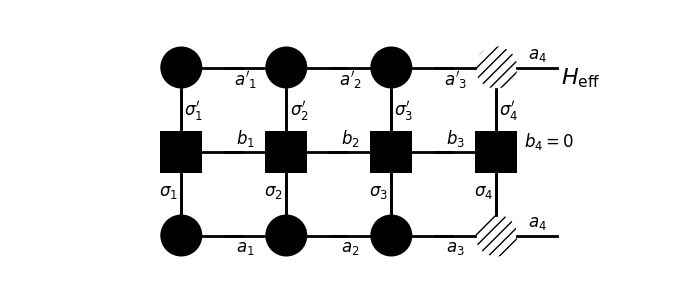

# How to solve an MPO in the NRG style

Suppose we have a Wilson chain hamiltonian $\{H_n\}$ with $n=1,\ldots,N$ the index of energy scale, we can write down its MPO in the following form:
$$
H_n(\vec\sigma,\vec\sigma') = [O^{\sigma_1,\sigma_1'}_{b_0,b_1},\ldots,O^{\sigma_i,\sigma_i'}_{b_{i-1},b_i},\ldots,O^{\sigma_n,\sigma_n'}_{b_{n-1},b_n}]_{5,0}
$$
Here,
$$
O=\begin{bmatrix}
1 & 0 & 0 & 0 & 0 & 0\\
f_{i\uparrow} & 0 & 0 & 0 & 0 &0\\
f_{i\uparrow}^\dagger & 0 & 0 & 0 & 0 &0\\
z_{i\uparrow}f_{i\downarrow} & 0 & 0 & 0 & 0 &0\\
z_{i\uparrow}f_{i\downarrow}^\dagger & 0 & 0 & 0 & 0 &0\\
H_{\rm loc}^{(i)} &t_i f_{i\uparrow}^\dagger z_{i\uparrow}z_{i\downarrow} & -t_if_{i\uparrow}z_{i\uparrow}z_{i\downarrow} & t_if_{i\downarrow}^\dagger z_{i\downarrow} & -t_if_{i\downarrow}z_{i\downarrow} &1\\
\end{bmatrix}
$$

Note:

* $z_{i\uparrow}=e^{-i\pi n_\uparrow}$ is the fermionic parity counter.
* No compression is allowed here, because any compression will mix hamiltonian terms in different energy scale.

### Algorithm

1. Construct all $O_{b_{i-1},b_i}^{\sigma_i\sigma_{i}'}$ in a Wilson chain, but considered into the hamitonian one by one.
2. At step $i​$, we obtain effective hamiltonian $H_{\rm eff}^{a_{i-1}'\sigma_i',a_{i-1}\sigma_i}​$ represented in the following contraction (without dashed circle), where $U^{\sigma_{i-1}}_{a_{i-2},a_{i-1}}​$ (round circle supplying index $a_{i-1}​$) is obtained from last iteration.
3. Diagonalize $H_{\rm eff}$ and obtain $U^{\sigma_i}_{a_{i-1},a_i}$ (the dashed circle).
4. With $E^{(i)}$, and a table of good quantum number $M^{(i)}$ (total spin), we can get $T\chi_{\rm imp}$ (an empty chain is need as a baseline, $T\chi_{\rm imp}=T\chi_{\rm tot}-T\chi_{\rm empty}$).
5. Truncate index $a_i$ to update $U^{(i)}$, rescale to update $O^{\sigma_{i+1}\sigma_{i+1}'}_{b_{i}b_{i+1}}$.
6. Repeat step 2 - 5 until the end of chain.
7. Collect $U^{(i)}$ to build up MPS so you can get other observables.